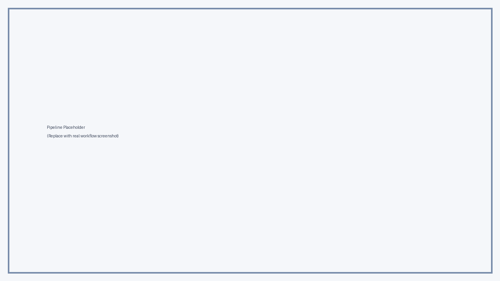
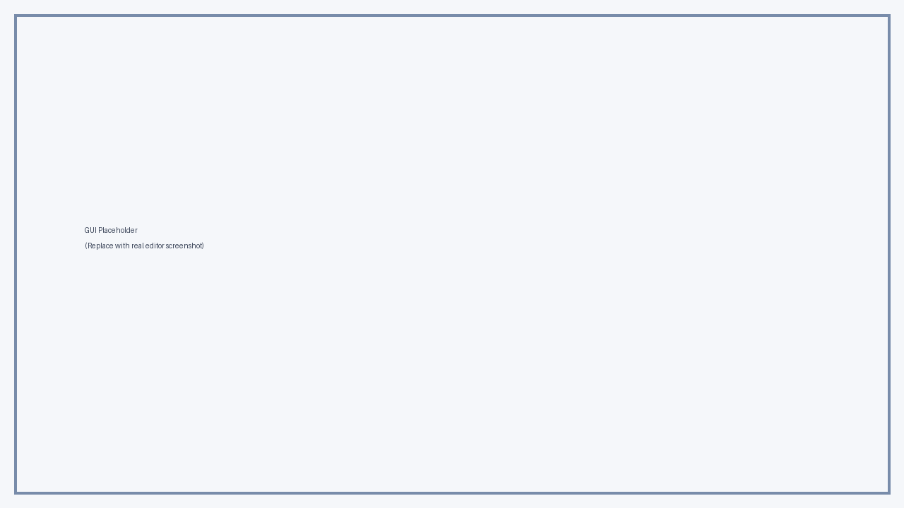

# Image Stitching Toolkit (Quick Start)

This project reconstructs fragmented grayscale images in two stages:

1. `scht.py`: cluster strips, compute an initial left-to-right order, and manually refine in GUI.
2. `pinheng.py`: load exported horizontal results and manually arrange vertical order in GUI.

> Current code lives in `pinjie/`.

## Quick Start

### 1) Prepare Python environment

```powershell
cd D:\123pan\s\code\venv1\.venv\AILearning\model
python -m pip install -r requirements.txt
```

### 2) Put input BMP strips in the expected folder

- Place source strips in `pinjie/tu2/`
- File names should be sortable (for example: `000.bmp`, `001.bmp`, ...)

### 3) Run stage 1 (`scht.py`)

```powershell
cd D:\123pan\s\code\venv1\.venv\AILearning\model\pinjie
python scht.py
```

What happens:
- The script preprocesses rows and applies 3 heuristic cleanup rounds.
- It clusters strips with KMeans (`n_clusters=11`).
- It computes per-cluster order with DP (bitmask path optimization).
- It opens an interactive GUI to drag/drop and fix ordering.
- It can export stitched cluster images.

### 4) Run stage 2 (`pinheng.py`)

After exporting stage-1 cluster images to a folder (for example `tu3`):

```powershell
cd D:\123pan\s\code\venv1\.venv\AILearning\model\pinjie
python pinheng.py
```

What happens:
- Load exported cluster images.
- Auto-suggest top-to-bottom order.
- Manually refine order with drag/drop and optional lock groups.
- Save the final merged result.

## Algorithm (At a Glance)

### Stage 1: `scht.py`

- **Feature build**: convert each strip into a row-wise binary signature.
- **Heuristic cleanup (3 rounds)**: detect suspicious run-length patterns (`num_0`, `num_1`) and zero-out likely missing/noisy regions.
- **Clustering**: `KMeans` groups strips by cleaned signatures (`img_trans_3.T`).
- **Ordering inside each cluster**:
  - edge feature: right edge of strip `i` vs left edge of strip `j`
  - pair cost: squared L2 distance
  - global order: bitmask DP in `find_optimal_order`

### Stage 2: `pinheng.py`

- Similar pairwise-cost idea, but for top/bottom edges (vertical arrangement).
- GUI supports manual corrections and lock-group constraints.

## Screenshots (Placeholders)

Replace these with real captures later.





## Project Layout

```text
model/
  README.md
  requirements.txt
  .gitignore
  docs/
    images/
      workflow-placeholder.png
      gui-placeholder.png
  pinjie/
    scht.py
    pinheng.py
    tu2/
    stitching_results.txt
    运行说明.txt
```

## Notes

- GUI flow is manual by design; final quality depends on interactive corrections.
- Threshold constants in `scht.py` are heuristic and data-dependent.
- If your data differs, tune `n_clusters` and rule thresholds.

